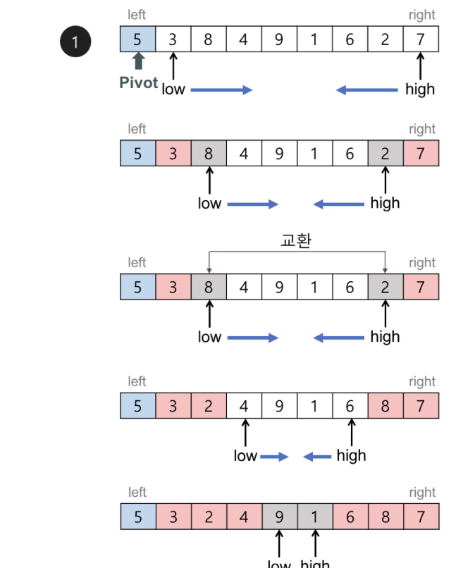
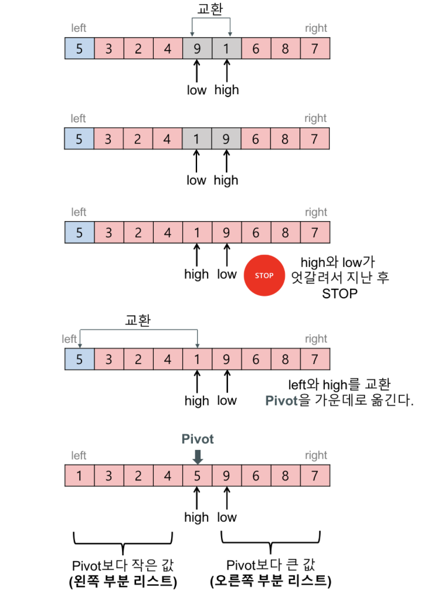
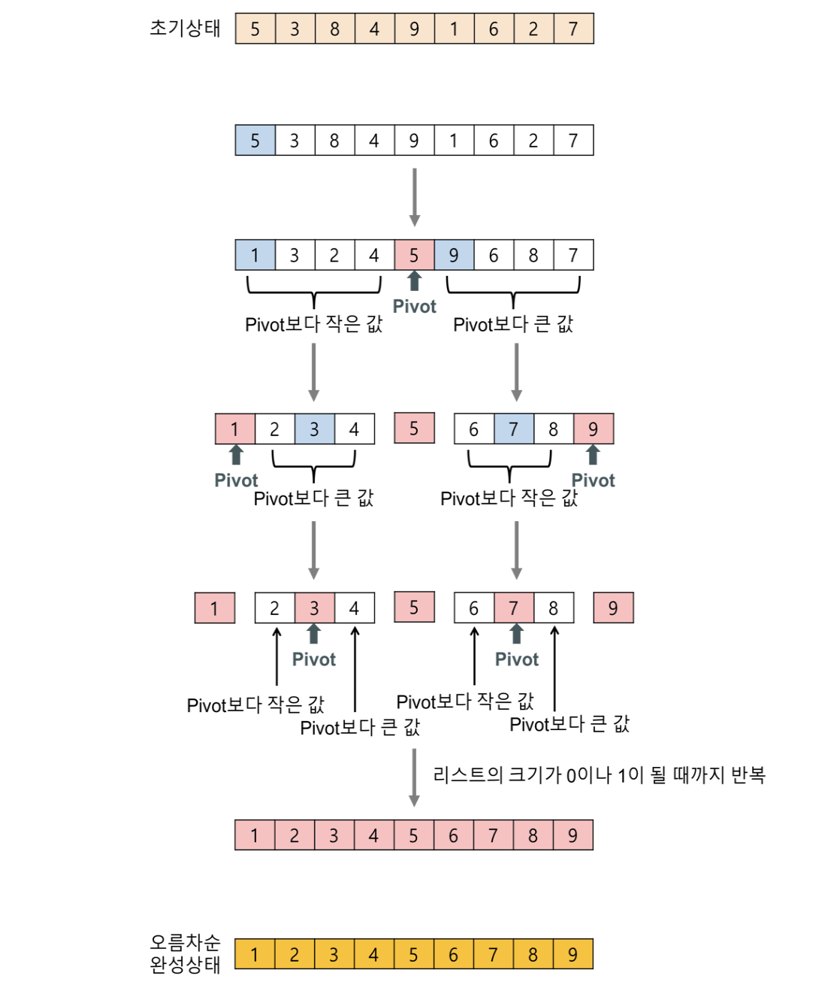

# Quick_Sort

**`피벗값을 이용한 분할정복 알고리즘을 적용한 정렬. '평균적으로 매우 빠른 수행 속도'가 나온다.`**

- [C++](./code/Quick.cpp)
- [JavaScript]
- [Python]

## 아이디어
오름차순 기준으로 생각하면..

1. 1회전: 적당한 피벗값을 선택한다(보통은 맨 앞의 원소를 피벗으로함)
2. low를 지정하고 왼쪽에서 오른쪽으로 탐색하다가 피벗값보다 큰지점이 나오면 스탑
3. hight의 인덱스를 맨오른쪽으로 지정하고 오른쪽에서 왼쪽으로 탐색하다가 피벗값보다 작은 지점 나오면 스탑
4. low < hight이면 교환후 다시 2~3번 반복
5. low > hight이 됬다면 pivot위치와 hight을 교환해준다.

1사이클을 거치면 pivot값의 위치는 찾았다 그래서 찾은 위치를 기준으로 오른쪽, 왼쪽으로 나눠서(분할) 1~5과정을 한번 더한다.

## 시간복잡도

- N번 비교하고, 중간 지점에서 절반으로 쪼개고 반복 logN -> O(logN*N)

## 장점

- 평균적으로 θ(N*logN)가 나오고 평균적으로 가장 빠른 정렬 방법이다.
- 추가적인 메모리를 필요로 하지 않는다.

## 단점
- 이미 정렬된 배열을 퀵소트 돌리면 N^2의 시간이 걸림.(최악의 상황에서 오래걸림)
- 불안정 정렬이다.
- 피벗값을 잘 선택해야 효율적으로 정렬할 수 있다.

## 참고자료
- https://gmlwjd9405.github.io/2018/05/06/algorithm-bubble-sort.html
- https://jinhyy.tistory.com/9