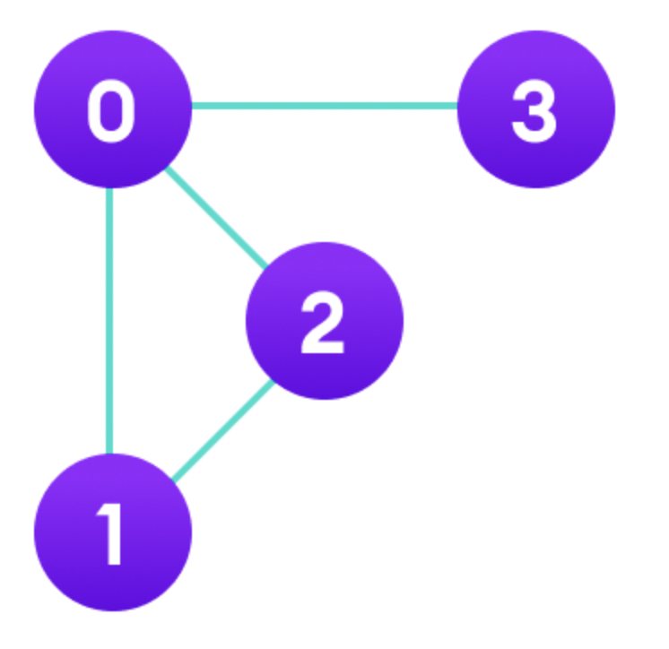

# 목차

- 복습
- 그래프-인접행렬
- 트리, 이진트리, 이진탐색트리
- 이진탐색트리 구현 -> AVL구현

---
# 복습 - 클래스
- 클래스를 사용할 때 메모리에서 일어나는 일
```cpp
class Animal{
	public:
		Animal(int age,string name)
		int GetAge();
		int mAge;
		string name;
};

Animal::Animal(){
	this->mAge = age;
	this->name = name;
}
int Animal::GetAge(){return this->mAge}

int main(){
	Animal* dog = new Animal(5,"juju");
	Animal* cat = new Animal(3,"miya");
	dog->GetAge();
	cat->GetAge();
}
```


---

# 복습 - 링크드리스트
> Linked List는 **물리적인 메모리상에서는 비연속적으로 저장**이 되지만 Linked list를 구성하는 각각의 Node가 next Node의 address를 가리킴으로써 **논리적인 연속성**을 가진 자료구조


## Array vs LinkedList
- 조회: O(1) vs O(N)
- 첫요소에 삽입,삭제 : O(N) vs O(1)
- memory관점에서 낭비되는 메모리가 없기 때문에 LinkedList가 유리할 수 있음. 필요한 만큼 사용가능.

---

# 그래프

> 간선과 정점으로 이루어진 집합

- 정점(Vertex): 노드라 불리며 점으로 표현되는 것. 위치, 상태, 사람 이런 것을 예로 들 수 있다
- 간선(Edge): 정점을 잇는 선(방향이 있음)
- 가중치: 정점을 간선을 통해 이동하는 비용.

ex) 지도에서 표현 구리 - 도농(가중치 예시 시간or돈), 좌표에서 위치(1,3),(4,3)(가중치는 실제거리 or이동해야할 최소 칸)


---

# 그래프

구리, 도농, 호평을 가지고 그래프를 만들어보자.

---

# 인접행렬과 인접리스트

> 컴퓨터에게 그래프를 표현하는 방식

- 인접행렬: 인접행렬이란 그래프에서 정점과 간선의 관계를 나타내는  bool 타입의 정사각형 행렬. 아래의 그림을 인접행렬로 나타내보자



---

# 인접행렬 연습

1. 0~9 10개의 노드가 있음. 1-2,1-3,3-4의 경로가 있다.
2. 0번부터 방문안한 노드를 찾고, 연결된 노드를 이어서 방문해 출력하는 함수 작성
3. 방문한 노드는 출력안되게 수정해보기.


---

# 트리

> 자식과 부모노드로 이루어진 **계층적 구조인 무방향 그래프**이고, **사이클이 없는** 자료구조

무방향은 선이 연결될 때 양방향으로 되는 간선임

- 같은 경로상에 위에 있으면 부모노드, 아래에 있으면 자식노드다. 특별히 자식노드가 없는 노드를 리프노드라 한다. 부모노드가 없는 노드는 루트 노드이다.

---

# 트리


- 트리 구조 특징: Vertex - 1 = Edge
- 두개의 노드를 선택하면 반드시 최단 경로가 1개 있다.

---

# 트리


- 깊이: 루트노드에서 특정 노드까지 갔을 때 최단 거리
- 높이: 리프~루트 노드의 거리
- 서브트리: 트리내의 하위집합 또는 부분집합을 서브트리라 함.

---

# 이진트리

> 각각의 자식 노드의 수가 2개 이하로 구성된 트리
> 


---

# 이진탐색트리

> 이진트리의 일종으로 오른쪽 하위트리 "노드보다 큰값", 왼쪽은 하위트리 "노드보다 작은값" 즉, 왼쪽, 오른쪽으로 나눠지는 기준이 있는 이진트리


- 검색에 매우 유리한 자료구조. 모든 자료를 뒤져볼 필요 없음 ex) 10탐색.

---

# 이진탐색트리

- 균형이 잡힌 이진트리면 탐색,삽입,삭제,수정 모두 O(logN)의 시간복잡도를 가진다.
- 균형이 잡힌 이진트리를 만드려면 삽입 순서가 중요하다. - 고려하지 않게되면 최악의 경우가 나타남
ex) 1,2,3을 이진탐색트리 구조에 삽입을 해보기(선형적 구조)
- 그래서 삽입순서가 어떻게되든 트리의 구조를 **회전**시키는 방법으로 균형을 보장하는 AVL트리, 레드블랙 트리등이 있다. map이라는 자료구조는 삽입, 삭제, 수정이 모두 O(logN)를 보장받는데 그 이유가 균형이 잡힌 레드블랙 트리를 기반으로하는 자료구조기 때문.

실습 AVL회전 보여주기 : https://visualgo.net/en/bst

---

# AVL트리 구현(코드 설명하는거 생각해보기)

---