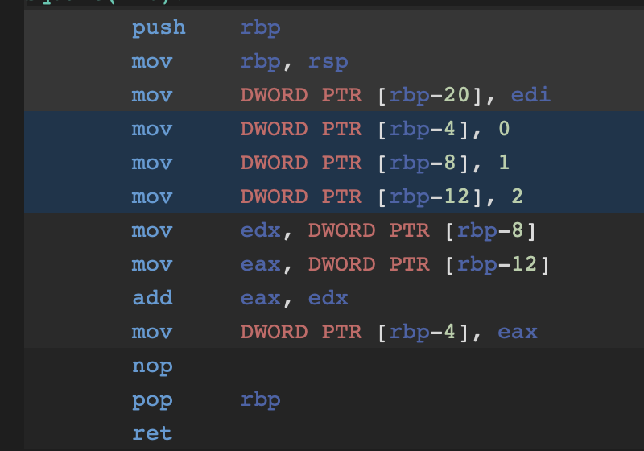

# 컴퓨터 구조

## 컴퓨터 구조를 알게되면..

1. 오류를 찾는데 조금 더 근본적인 접근법을 얻게됨.(메모리 동기화, Segmant fault 등)
2. 성능, 용량 이런 것이 왜 업그레이드 되야되고를 조금더 이해할 수 있음(비용 절감의 가능성)


## 컴퓨터 구조

**`컴퓨터는 계산기다.`**


**`컴퓨터는 0과 1만을 이해한다`**


## 컴퓨터 부품

컴퓨터의 핵심부품 4가지는.. CPU,메모리,보조기억장치,입출력장치 이다. 기본적으로 컴퓨터를 구동 시키기 위한 장치들임.

그 중 컴퓨터의 성능에 관련 있는 것의 핵심 부품은 메모리와 CPU이다.


## CPU와 메모리의 동작 원리

### ALU

쉽게말하면 계산기이다


- OPCODE에는 더하기,빼기,나누셈 연산 등 약속된 숫자가 들어감
- Operand1,2는 계산할 숫자
- Status는 결과에 대한 상태 표시 ex)올림자리 표시
- Result는 결과 값이 반환된다.

(ALU에 입력하는 데이터를 명령어 셋으로 만들 수 있지 않을까..?)
0000 0001(여기까지가 OPCODE) 0000 0000 0001(1) 0000 0000 0001(1)


### CPU(Central Processing Unit)

ALU와 기억장치 제어장치가 함께 있는 부품이다. 이것을 하나의 코어로 본다.

1. 제어 장치 (CU, Control Unit): 메모리에서 명령을 가져와 명령어 해독과 해독된 명령어 실행을 지시하는 핵심 장치다.
2. 연산 장치 (ALU, Arithmethic Login Unit): 제어 장치의 지시를 받아 산술, 논리, 비트 연산등의 실제 연산을 수행하는 장치다.
3. 기억장치 (Register): 제어, 연산 장치 등에서 사용하는 임시 기억 장치의 역할을 수행한다. (자세한건  참고자료)

```c
word add (void)
{
   int temp;
 
   temp = a;
   c = a + b;//이 부분이 어셈블리어로 변환된 것.
 
   return;
}
```
의 코드가 아래와 같이 어샘블리어로 변환된다 하자(실제로 이것보단 더 복잡)
```
0x1000   LOAD 0x2000  
0x1002   ADD 0x2002     
0x1004   STORE 0x2004
```

a의 주솩 0x2000, b의 주소가 0x2002, c의 주소가 0x2004라고 하자.

값을 Data Regster에 load해서 ADD 0x2002 이전에 Load되어 있던 a값과 새로 load하는 b값을 더한 후 STORE 0x2004 그 더한 결과값을 c의 주소에 저장하는 것.

이것을 LOAD와 ADD STORE의 과정을 CPU구조를 통해 보자.

- LOAD


1. PC가 0x1000인데 그것을 그대로 AddressRegister에 넣어서 External Memory에 Access한다.
2. 접근해 읽은 값을(LOAD명령어) IR에 올린다.
3. IR에 올린 값을 그대로 디코더에 넣어준다. (이때 PC는 다음 연산을 가져오기 위해 증가시킨다.)
4. 해석된 의미를 CU에서 실행 - 0x2000의 값을 불러오라고 했으므로 CU를 통해 External Memory에 접근한다.
5. Memory에서 접근한 값을 데이터레지스터에 넣고 ALU에 사용한다.(Load이므로 딱히 연산이 수행되진 않음)
6. ACC라는 임시 저장소에 그 값을 임시저장한다.(나중에 사용될 수 있으므로)

- ADD
  


1. 1~4과정을 반복한다.(PC => IR 0x1002의 메모리에 접근해 연산을 가져옴 - 해석 - CU에서 처리)
2. CU에서 해석된 것에서 0x2002메모리에 접근해 데이터를 가져와 Data Register에 저장시킨다.
3. Data Register와 ACC에 저장됟 값을 ALU에서 연산하고 다시 ACC에 넣어준다.
4. Memory에서 접근한 값을 데이터레지스터에 넣고 ALU에 사용한다.(Load이므로 딱히 연산이 수행되진 않음)
5. ACC라는 임시 저장소에 그 값을 임시저장한다.(나중에 사용될 수 있으므로)

- STORE
  


1. 1~4과정을 반복한다.(PC => IR 0x1004의 메모리에 접근해 연산을 가져옴 - 해석 - CU에서 처리)
2. CU에서 해석된 것에서 0x2004메모리에 저장이 될 수 있도록 신호를 발생시키고
3. ALU에서 나온 ACC에 준비된 값을 외부 메모리에 저장을 직접 시킨다.


중요한건 명령어를 읽고(Fetch) => 해석하며 (Decode) => 실행(Excution)과정을 거친다.

이것을 한번에 하는 것이아니라 하나의 단계가 너머가면 바로 다음걸 실행한다.


이렇게 한싸이클 마다 한단계씩 처리한다!!

### CPU 연산 해보기


실제 이 코드를 어샘블리어로 바꾸면 아래와 같다(레지스터를 추가시켜 주기)



https://godbolt.org 사이트를 통해 어셈블리어를 직접 해석해보기

1Core의 CPU가 위와같은 일을 한다.

### 성능 = 클럭수?

그래서 초창기에는 CPU의 클럭수를 높이는게 곧 성능이엿다. 그러나 발열문제로 인해 더이상 클럭수를 높여서 성능을 높일 수 없게 되었다. 그때 유행하던것이 멀티코어 CPU다.


### 멀티코어 CPU구조

따라서 현대에 코어수가 많은 CPU구조는 아래와 같이 되어있다. 각각의 코어마다 캐시 메모리가 있고 두개의 코어마다 캐시, L3캐시 등 계층적으로 들어간다.


이것을 도식화 하면 아래와 같다.


그러나 코어를 나누게 된다면 동기화 문제가 발생하는데

운영체제에서 Core마다 일을 처리하고 제일 중요한 동기화 문제를 관리하기위한 기법들이 있다.(운영체제에서 다룸)

## 시스템 버스

메인보드의 도식화를 다시한번 살펴보면


시스템 버스는 크게 3가지인데, 주소버스, 데이터버스, 제어버스 이다.

각각이 아래와 같이 사용이 된다.


## 참고자료
- https://www.youtube.com/watch?v=LBqJwmFMQHI
- https://hwannny.tistory.com/96
- http://recipes.egloos.com/v/4982170