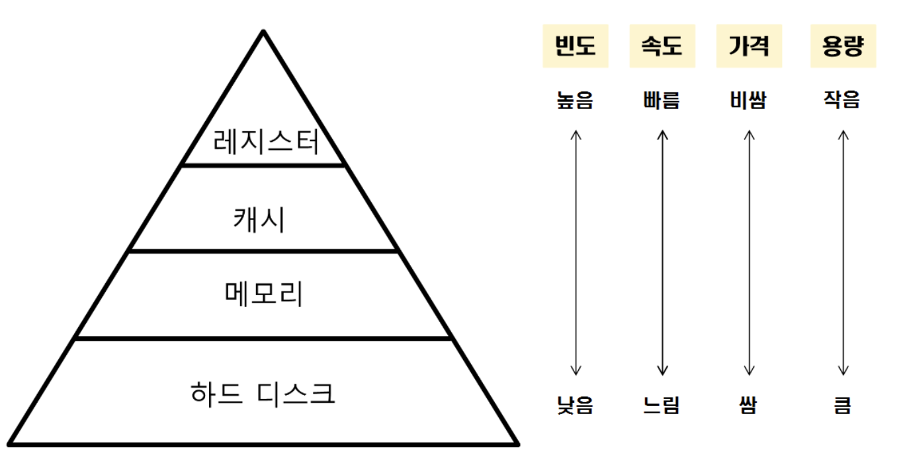
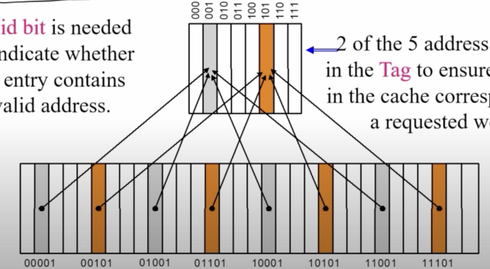
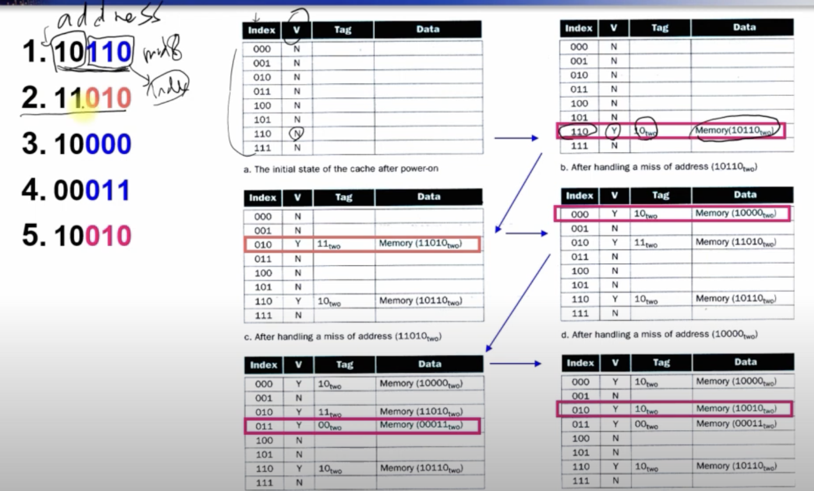
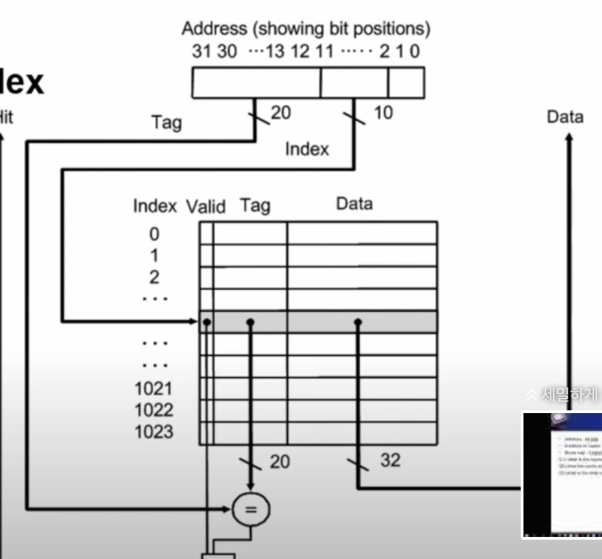
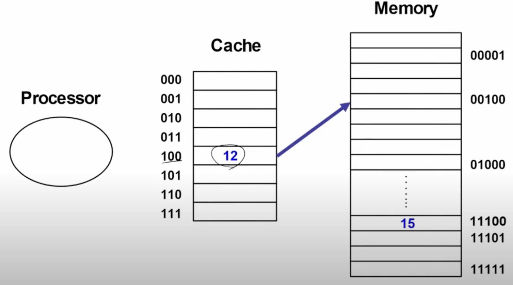
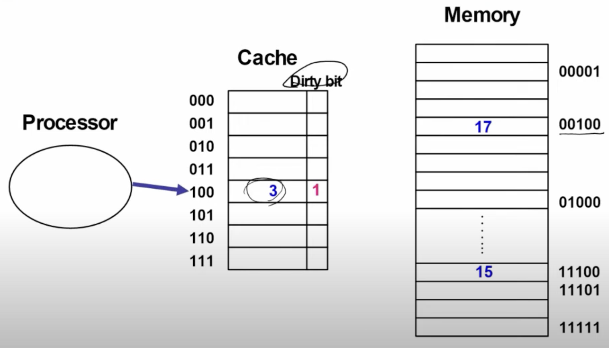
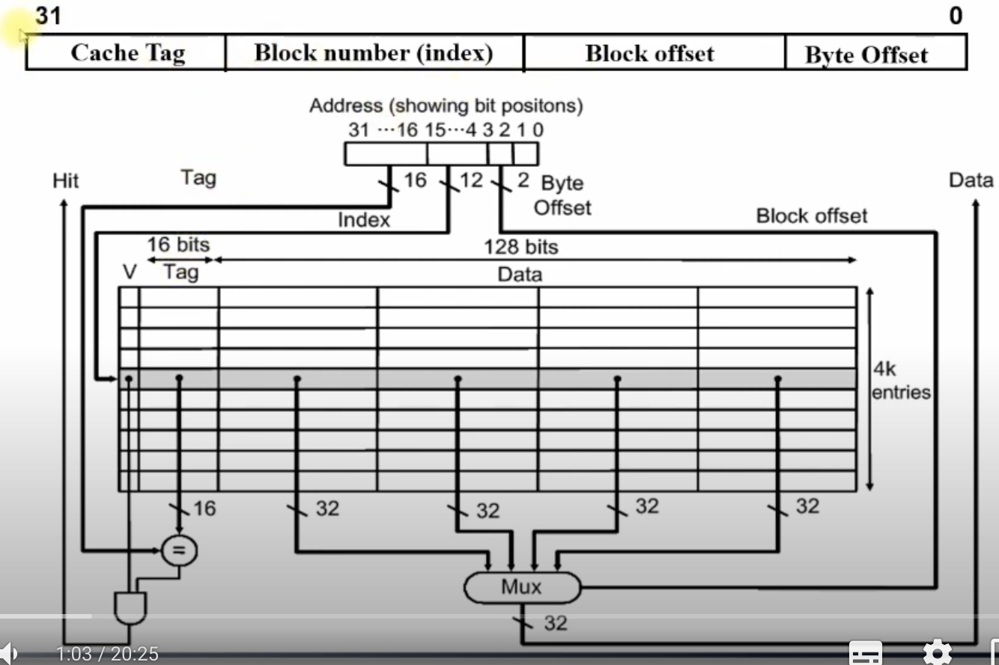
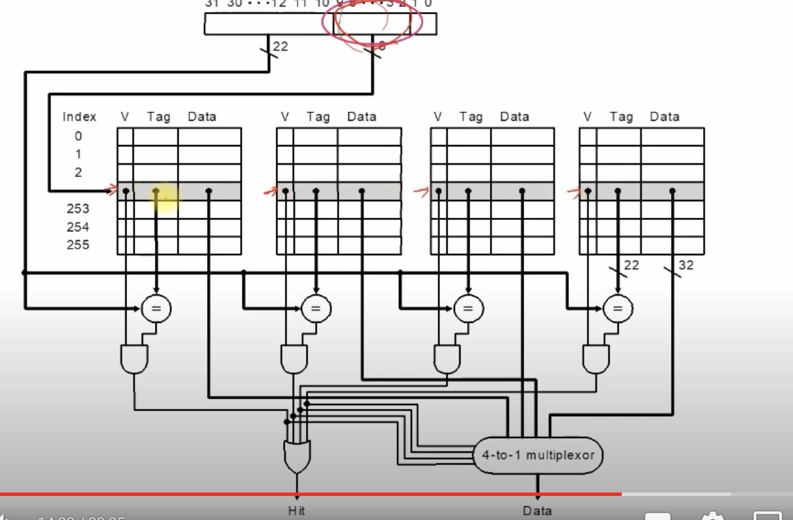

# 메모리 계층

## 메모리 계층

메모리를 필요에 따라 나눈 것. CPU가 빠른 접근을 위해 계층화를 했음. 계층 구조를 통해서 메모리를 가져온다.



## CPU에서 메모리 읽기를 요구할 때...



위와같이 캐시랑 메모리의 구조가 되어있다고 하자

첫번째 규칙은 아래와 같다.

1. 접근할 메모리의 끝부분 3자리로 캐시에 접근
2. 데이터가 있을 경우 사용하고 없으면
3. 하위 메모리에서 해당 5자리 주소에 접근해 캐시 메모리에 저장시키며 가져온다.



위와 같은 순서로 접근한다고 생각해보자.

5번째에 교체가 한번 일어난다

```
10110 => 5
11110 => 10
11001 => 15
11010 => 20
11011 => 25

표와함께 메모리 적어보기
```
ㅇㅇㅇ으  


ㅇㅏㅏㅓ
### 실제 메모리 32비트주소체계 에서...



캐시메모리의 크기를 한번 계산해보자

태그의 크기로 사이즈가 정해지는데

태그의 크기는 = 32 - (캐시메모리의 인덱스 크기만큼이 나눠지고 =10) - (주소 체계 오프셋 2) => 20


=> 그러면 64비트에서 캐시인덱스가 1024일때 캐시 메모리의 크기는 어느정도일까?

## 그럼 메모리 쓰기 과정은?

매번 하위 메모리에 써줘야될까??



비용이 크다 => 하위 메모리를 읽어올 때 반영해주자



쓰기 과정이 들어갔다면 dirty 비트를 1로 설정해준다.

그리고 해당 캐시 지점을 읽으면 dirty를 0 으로 바꾸면서 읽어온다.

장점: 평상시에 좋다.
단점: 충돌이 일어났을 때 메모리에 한번 써주고 읽는과정도 해야되서 두번 작업해야됨

## 캐시메모리 성능향상

컴퓨터가 접근하는 메모리의 특징이 있다. 

메모리를 가져올 땐 자주 접근되는 데이터를 주로 가져오고

```
a = 10;
a*2;
```

그 주변 데이터를 함께 가져오는 경우가 많다.
```
arr[10]
```

그래서 주변 데이터까지 다 가져오는 방식을 채택한다.

1. directed mapped

메모리에 접근하는 주소가 캐시에 맵핑되는 위치가 딱 한곳으로 결정이 된다.



장점: 캐시 주소를 찾는게 간단하다
단점: 한곳으로 집중되어잇기 때문에 한곳에 대한 액세스(읽기 쓰기)가 자주 일어나면 캐시가 의미가 없게 된다.

2. n-way 방식

4개중에 한군대를 찾는다. 그래서 캐시의 인덱스가 줄어든다.



## 참고자료
- https://www.youtube.com/watch?v=FyUalgu52pU&list=PLoJdZ7VvEiRMErS6bqnO_lZNGRdjsT93t&index=6

한동대학교 컴퓨터 구조 강의