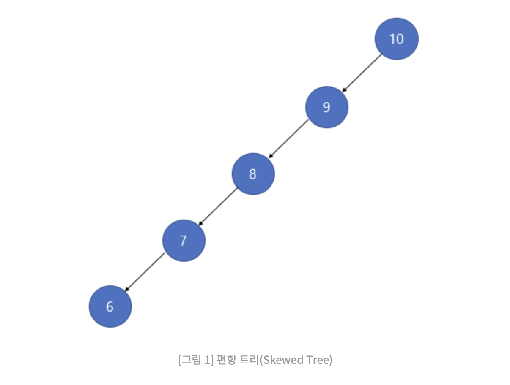
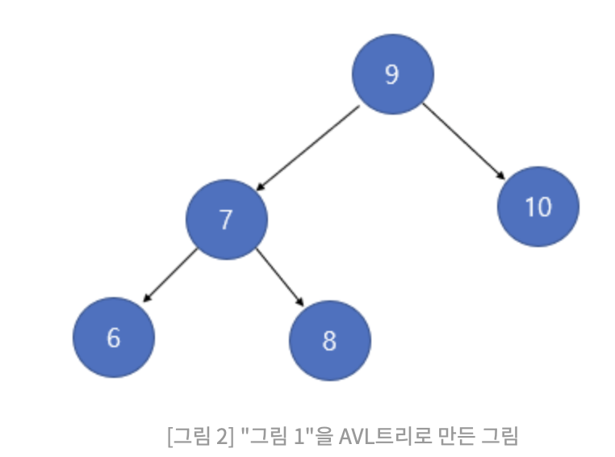
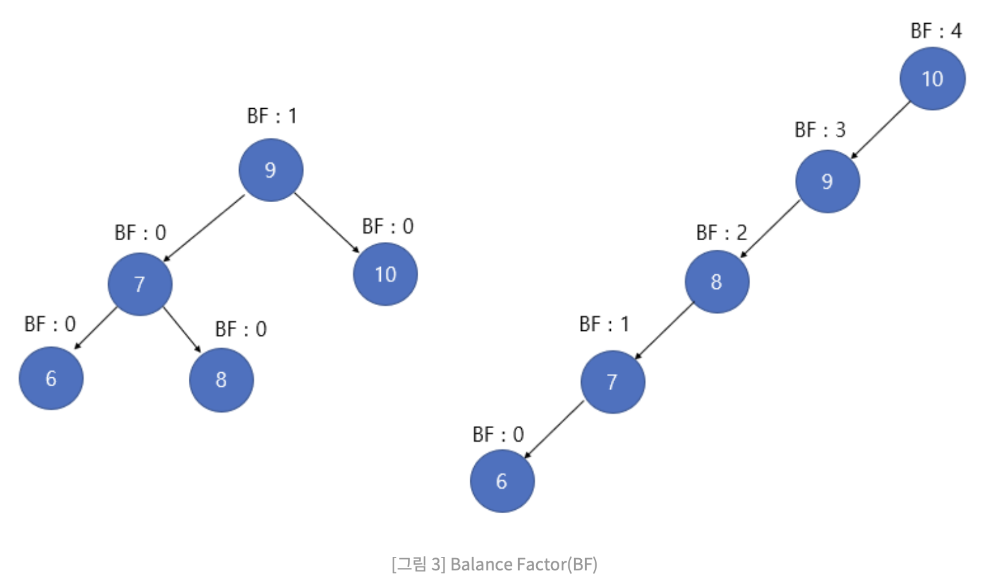
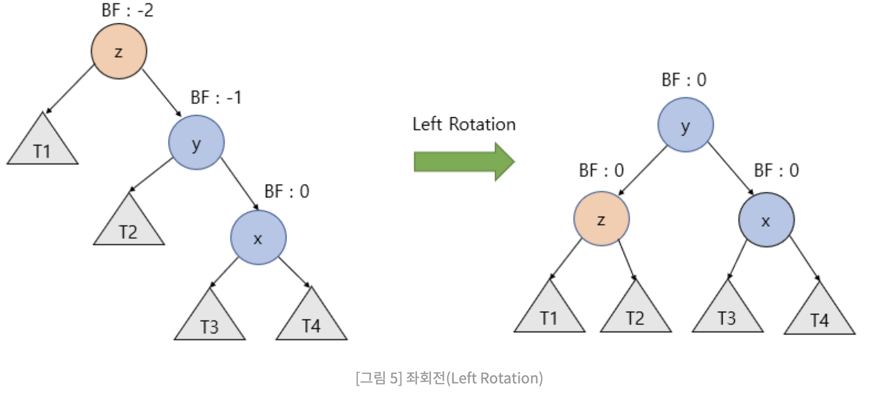
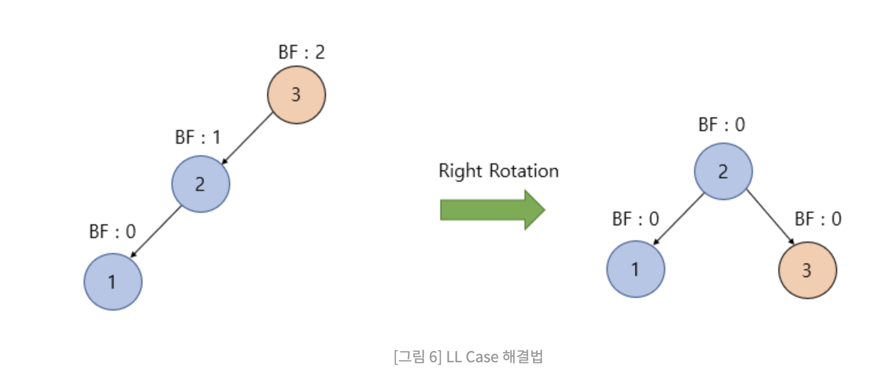
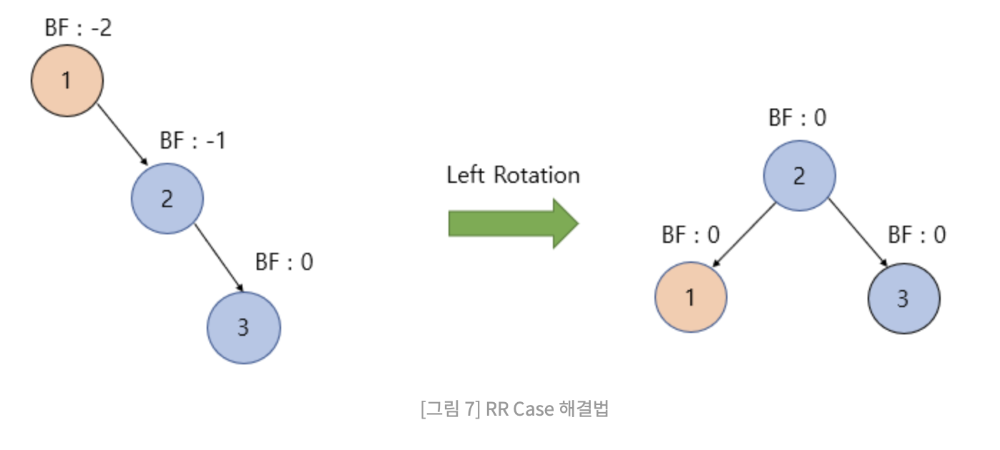
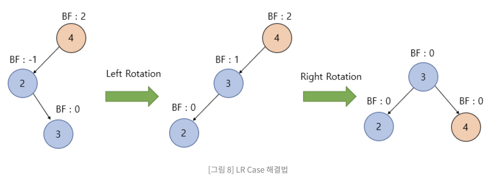
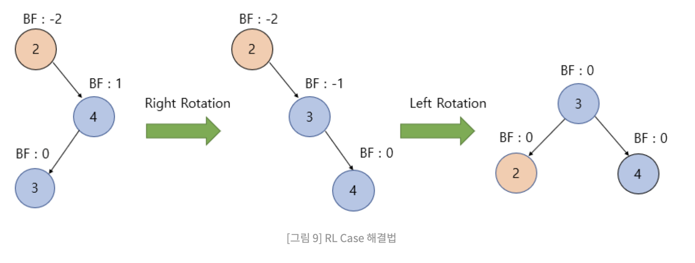

# AVL트리

> 이진탐색트리는 삽입순서가 최악이면 불균형한 트리가 되는데, 그 단점을 보완한 "균형을 보장"하는 이진탐색트리

- [C++](./code/C++/AVL.cpp)

에서

로 되어야하는게 AVL트리다.

## AVL트리 특징
- 이진탐색트리의 속성을 따라간다
- 왼쪽, 오른쪽 서브트리의 높이차이가 1이하다.
- 높이차이가 커지면 회전을 통해 균형을 맞춘다.
- 삽입,검색,삭제의 시간복잡도를 O(logN)을 보장한다.

## 회전과정

### Blance Factor

각 노드의 왼쪽, 오른쪽 서브트리의 차이를 BF지수로 나타냄

왼쪽 서브트리 높이 - 오른쪽 서브트리 높이

따라서 AVL트리에서는 BF값이 -1,0,1로 유지되어야됨. 그 이외의 값이 나오면
해당 AVL트리는 균형이 깨진것으로 간주하고 회전에 들어가야된다.

### 우회전

우회전이 발생한 경우는 BF2인 노드가 생겼을 때 발생한다.

순서대로 요약하면

1. y노드의 오른쪽 자식을 z노드로 바꾸고
2. z노드의 왼쪽 자식을 y노드의 오른쪽자식으로 바꾼다.

### 좌회전

BF-2인 노드가 생겼을 때 발생한다.

1. y노드의 왼쪽 자식 노드를 z노드로 변경한다.
2. z노드 오른쪽 자식노드를 y노드의 왼쪽 자식으로 변경한다.

그렇다면 두개의 회전이 어떨 때 발생하는지 알아보면 4가지의 경우가 있다.

### LL Case

BF2인 노드기준으로 왼쪽 -> 왼쪽 노드가 존재하면 우회전으로 균형을 맞춰줌

### RR Case

-2인 노드 기준으로 오른쪽 -> 오른쪽 노드가 존재하면 좌회전으로 균형을 맞춰준다.

### LR Case

2인 노드 기준으로 왼쪽, 오른쪽으로 노드가 존재한다면 LR Case이다.

BF2인 노드의 왼쪽 서브트리를 좌회전을 하고, LL Case로만들어주고 우회전으로 균형을 맞춘다.

### RL Case

-2인 노드기준으로 오른쪽, 왼쪽노드가 존재한다면 RL Case이다.

LR case와 마찬가지로 BF-2인 노드기준으로 오른쪽 서브트리를 우회전 한번 시키고, RR Case로만들어 좌회전을 시킨다.

## 참고자료

- https://visualgo.net/en/bst
- https://code-lab1.tistory.com/61
