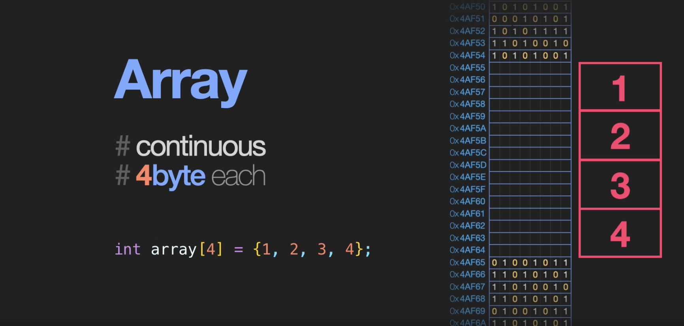
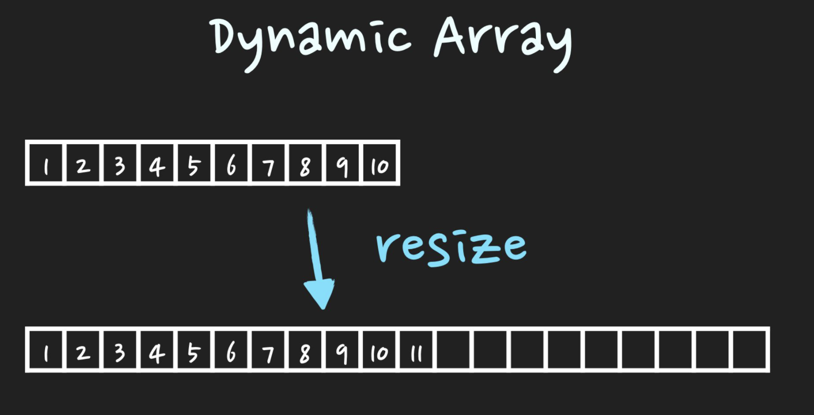

# 배열과 동적배열(Array & Dynamic Array)

## 배열

**`Array는 연관된 data를 '메모리상에 연속적이며 순차적'으로 미리 할당된 크기만큼 저장하는 자료구조`**

## 배열의 특징

- 고정된 저장 공간(fixed-size)
- 순차적인 데이터 저장(order)

Array의 장점은 조회작업이 굉장히 빠르다.
조회를 자주 해야되는 작업에 많이 사용

Array의 단점은 fixed-size.
이는 메모리 낭비나 추가적인 overhead가 발생

## 배열의 장점

- 조회가 편하다
- 물리적으로 연속적이므로 메모리관리 관점에서 편할 수 있다.

## 단점

- 크기가 고정되어 있기 때문에 예측되지 않는 배열이라면 안쓰는 공간도 잡아둬야되기 때문에 메모리 낭비로 이어진다.
- 실행 컨텍스트에서 크기를 변경할 수 없다.
- 이미 중간에 자료가 있고 그곳에 데이터를 삽입 하려면 추가하고 한칸씩 shift해서 복사 붙여넣기를 해줘야된다.

## 동적배열(Dynamic Array)

**`Dynamic Array는 저장공간이 가득 차게 되면 'resize'를 하여 유동적으로 size를 조절하여 데이터를 저장하는 자료구조`**

즉, 배열의 단점인 고정된 크기를 동적 배열은 고정된 크기에서 벗어나면 더 큰 배열을 만들어주는 단점을 보완한 자료형이다.

## 동적배열의 특징

고정된 크기에서 원소를 삽입하려고 하면 resize이라는 과정을 거쳐야된다. 이때 보통 쓰는 방법이 doubling이다. 데이터를 추가하다가  메모리를 초과하게 되면 기존 배열의 size보다 두배 큰 배열을 선언하고 데이터를 일일이 옮기는방법. 따라서 O(n)의 시간이 걸림.

데이터를 추가할때 사이즈를 초과해서 가끔 발생하는 O(n)의 resize하는 시간이 있으나, 자주 발생하지 않으므로 O(1)의 시간이 걸린다고 봄.

C++에선 vector를 사용해 dynamic Array를 사용한다.