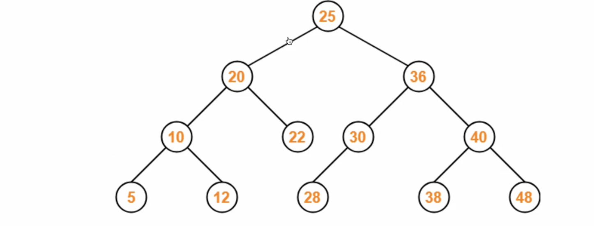
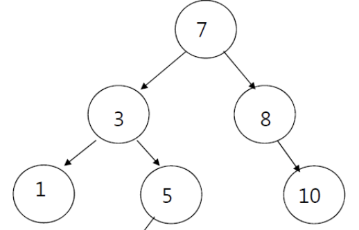
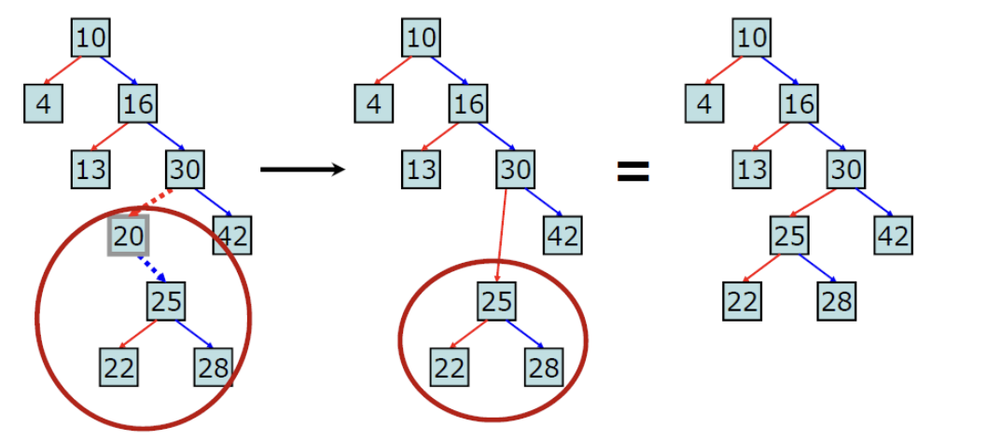
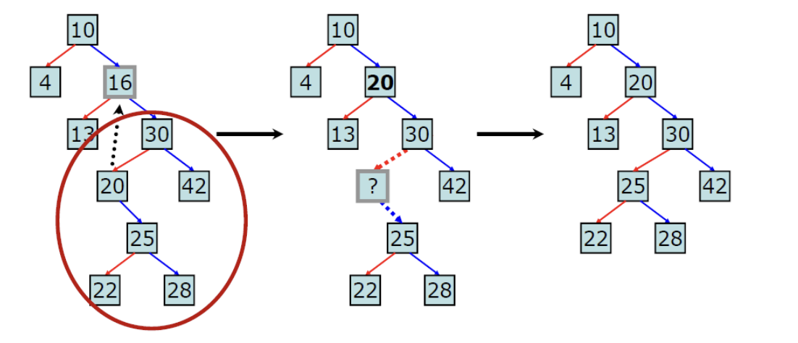
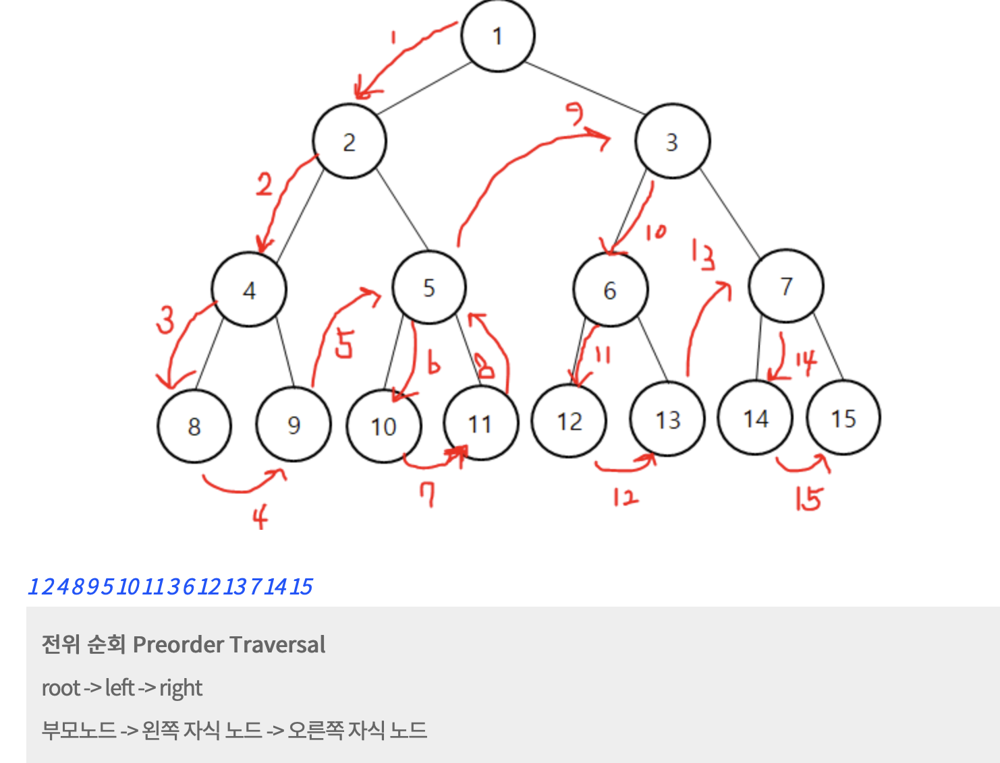
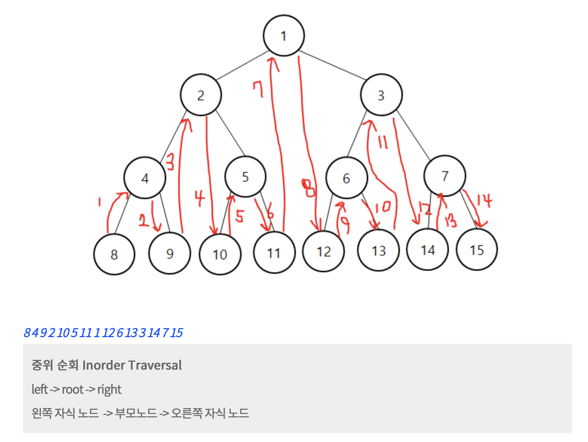
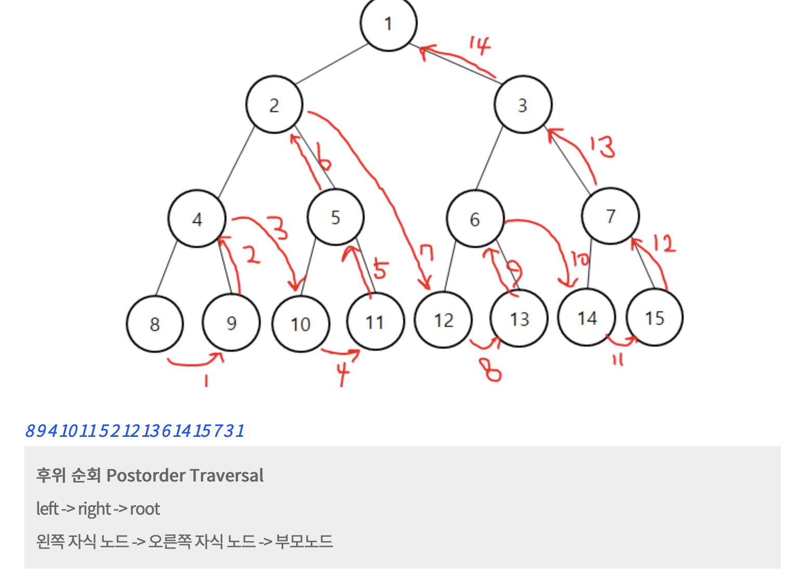

# 이진탐색트리

> 이진트리의 일종으로 오른쪽 하위트리 "노드보다 큰값", 왼쪽은 하위트리 "노드보다 작은값" 즉, 왼쪽, 오른쪽으로 나눠지는 기준이 있는 이진트리 - 중복되는 값이 없는게 전제!



- [C++](./code/C++/BST.cpp)
- [Javascript++](./code/C++/)
- [Python](./code/Python/BST(temp).cpp)
---

## 이진탐색트리 구현

링크드리스트와 같이 Node구조체를 연결시켜 준다.

그러나 노드의 구조가 왼쪽, 오른쪽 자식이 있기에 포인터를 Left,Right를 둔다.

```cpp
struct node{
  int data;
  node* left;
  node* right;
}
```

### 조회

1. 루트노드를 가져온다.
2. 찾을 데이터보다 크면 오른쪽, 작으면 왼쪽으로 이동한다.
3. NULL로 된다면 찾을 값이 없는 것!


해당 트리에서 38 찾기 과정.

### 삽입

0. 해당 데이터가 없는지 검색한다. 있으면 실패 반환
1. 노드를 생성한다.
2. 루트 노드가 없다면 그 노드가 루트노드가 된다.
3. 루트 노드가 있다면 해당 노드보다 큰 값이면 오른쪽child를, 작은 값이면 왼쪽child로 이동한다. 반복하다가 해당 지점에 없다면 child를 지정한다.



해당 노드에서 4를 insert하면 루트부터 타고타고 가서 5의 왼쪽에 삽입이 된다.

### 삭제

삭제하려고 하는 노드를 찾은뒤에 경우의 수는 3가지 이다.

삭제의 케이스는 3가지가 있다.
1. 삭제노드가 리프노드일때.
- 이 경우는 해당 노드를 그냥 삭제하면 된다.

2. 삭제노드의 자식이 1개일 때
- 삭제노드의 자식노드도 삭제노드의 부모의 규칙에 벗어나지 않기 때문에 그 자식노드를 그냥 연결해주면된다.



3. 삭제노드의 자식이 2개일 때.
- 오른쪽 자식 트리에서 가장 작은 값을 삭제노드 위치에 올리고 삭제된 위치는 가장작은 값의 삭제노드의 부모노드랑 그 하위노드를 연결 해준다.



=> 왜 이 방식이 항상 이진트리가 만족이 되는가 에 대한 부가설명은 중위순회를 보고!

## 이진트리 순회

트리구조는 순회하는 코드가 있다.

- 전위 순회



```cpp
		void travelBSTNode(Node* temp){
      //내가 해당 노드를 만났을때 처리할 로직
      cout << temp-> data << " ";
      //여긴 출력만함
			if(temp->leftchild!=NULL){
				travelBSTNode(temp->leftchild);
			}
			
			if(temp->rightchild!=NULL){
				travelBSTNode(temp->rightchild);
			}
		}
```

- 중위 순회


```cpp
		void travelBSTNode(Node* temp){

			if(temp->leftchild!=NULL){
				travelBSTNode(temp->leftchild);
			}
			
      //내가 해당 노드를 만났을때 처리할 로직
      cout << temp-> data << " ";
      //여긴 출력만함

			if(temp->rightchild!=NULL){
				travelBSTNode(temp->rightchild);
			}
		}
```


- 후위 순회


```cpp
		void travelBSTNode(Node* temp){

			if(temp->leftchild!=NULL){
				travelBSTNode(temp->leftchild);
			}
			

			if(temp->rightchild!=NULL){
				travelBSTNode(temp->rightchild);
			}

      //내가 해당 노드를 만났을때 처리할 로직
      cout << temp-> data << " ";
      //여긴 출력만함

		}
```

오른쪽 순으로 짜보기??-> 오른쪽 전위순회


## 이진탐색트리 특징

- 균형이 잡힌 이진트리면 탐색,삽입,삭제,수정 모두 O(logN)의 시간복잡도를 가진다.
- 균형이 잡힌 이진트리를 만드려면 삽입 순서가 중요하다. - 고려하지 않게되면 최악의 경우가 나타남
ex) 1,2,3을 이진탐색트리 구조에 삽입을 해보기(선형적 구조)
- 그래서 삽입순서가 어떻게되든 트리의 구조를 **회전**시키는 방법으로 균형을 보장하는 AVL트리, 레드블랙 트리등이 있다. map이라는 자료구조는 삽입, 삭제, 수정이 모두 O(logN)를 보장받는데 그 이유가 균형이 잡힌 레드블랙 트리를 기반으로하는 자료구조기 때문.
- 검색에 매우 유리한 자료구조. 모든 자료를 뒤져볼 필요 없음.

## 참고자료
- https://ratsgo.github.io/data%20structure&algorithm/2017/10/22/bst/
- https://visualgo.net/en/bst
