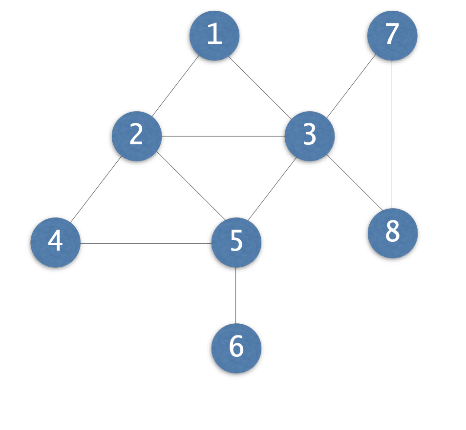
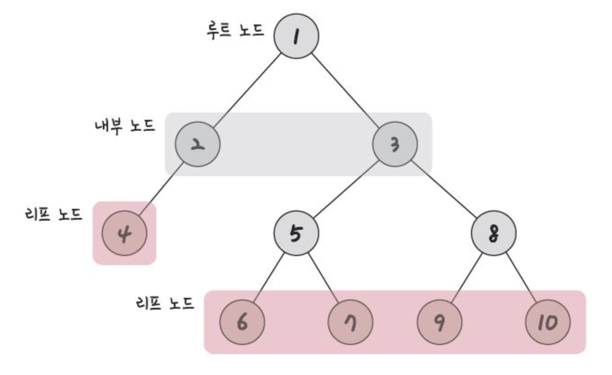
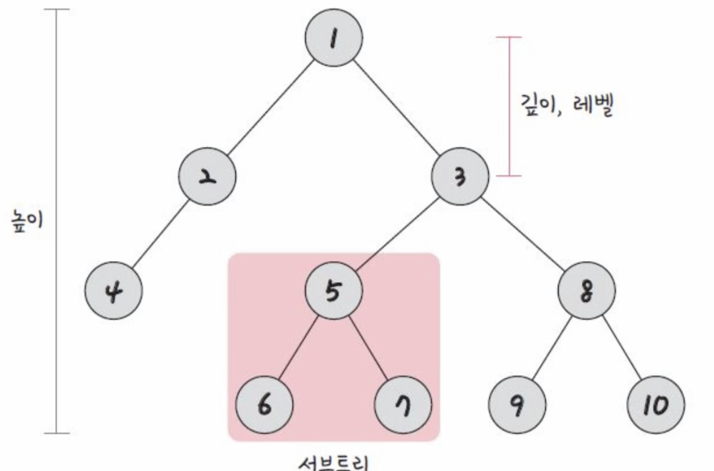
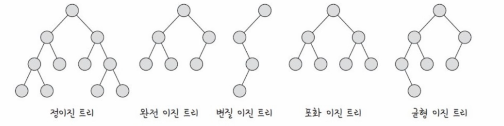

# 그래프

> 간선과 정점으로 이루어진 집합

- 정점(Vertex): 노드라 불리며 점으로 표현되는 것. 위치, 상태, 사람 이런 것을 예로 들 수 있다
- 간선(Edge): 정점을 잇는 선(방향이 있음)
- 가중치: 정점을 간선을 통해 이동하는 비용.

ex) 지도에서 표현 구리 - 도농(가중치 예시 시간or돈), 좌표에서 위치(1,3),(4,3)(가중치는 실제거리 or이동해야할 최소 칸)

위의 사진에서 정점은 8개, 간선은11개있고, 보통 가중치가 적혀있지 않다면 이동비용을 1로 생각해도 된다.

또한 방향이 표시되어 있지 않다면 무방향 간선(양방향)으로 생각하면된다.

## 트리

**`자식과 부모노드로 이루어진 '계층적 구조'인 '무방향 그래프'이고, 사이클이 없는 자료구조`**

- 같은 경로상에 위에 있으면 부모노드, 아래에 있으면 자식노드다. 특별히 자식노드가 없는 노드를 리프노드라 한다. 부모노드가 없는 노드는 루트 노드이다.

- 트리 구조 특징: Vertex - 1 = Edge
- 두개의 노드를 선택하면 반드시 최단 경로가 1개 있다.

- 깊이: 루트노드에서 특정 노드까지 갔을 때 최단 거리
- 높이: 리프~루트 노드의 거리
- 서브트리: 트리내의 하위집합 또는 부분집합을 서브트리라 함.

# 이진트리

**`각각의 자식 노드의 수가 2개 이하로 구성된 트리`**

