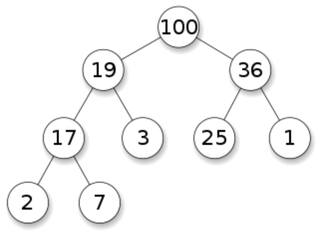
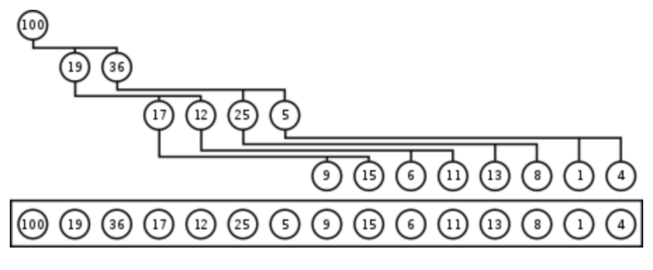
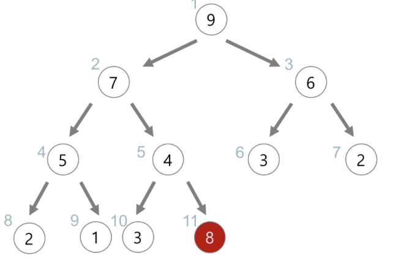
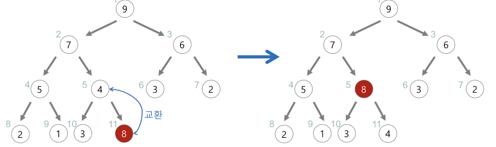
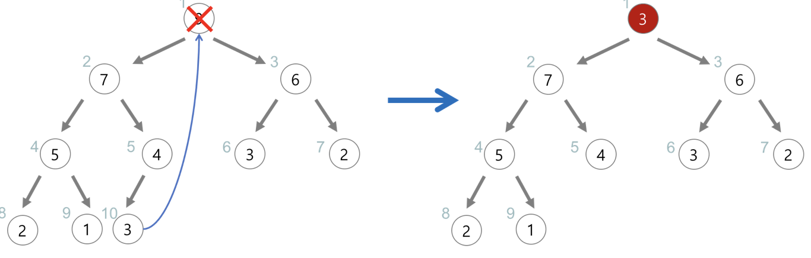
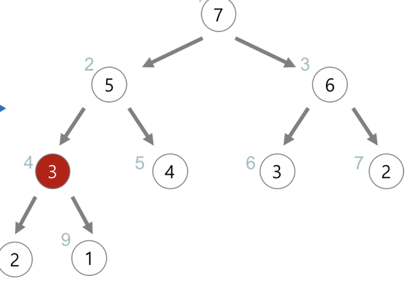

# 힙&우선큐(Heap & Priority_Queue)

힙 구현
- [C++](./code/C++/Heap.cpp)
- JavaScript
- Python
  
## 힙

**`이진트리에서 부모노드와 자식노드의 규칙을 추가한 자료구조! 최대값이나 최솟값을 빠르게 찾을 때 많이 쓴다.`**

## 특징

- 최대나 최솟값을 기준으로 힙을 짯다면 루트노드가 항상 최대 or 최소값이 된다.
- 이진탐색트리와 다르게 중복된 값을 허용한다.
- 부모노드가 자식노드보다 큰 값이면 최대힙, 반대면 최소힙이라한다.

## 구현

### 배열로 구현하기

힙 자료구조는 배열로 구현이 가능하다.

위의 힙 자료 구조를 루트 노드부터 1번 인덱스라 생각하고 차례대로 순서를 정해보자 그러면 아래와 같다.

그러면 인덱스상 아래와 같은 특징이 보인다. 부모노드가 i라면, 왼쪽 자식노드는 i\*2, 오른쪽 자식노드는 i\*2+1이 나온다!

이것을 이용해 부모와 자식간 교환을 한다.

### 삽입

(반복)

위와 같이 8을 추가한다 하면 프로세스는 아래와 같다.
1. 추가할 데이터를 끝에 추가한다.
2. 부모노드와 비교해서 조건에 틀리다면 바꿔준다. (4<8 이므로 교환!)
3. 2과정을 멈출 때까지 반복한다!
4. 반복하게 된다면 8의 위치는 9의 자식노드가 된다!

### 삭제

힙에서 삭제는 루트노드 삭제만 있을 뿐이다. 만약 다른 노드를 찾아서 삭제하는 것이라면 다른 자료구조를 쓰는게 합리적일 수 있다.

프로세스는 아래와 같다.

1. 루트노드를 삭제한다.
2. 맨 끝의 노드를 루트노드로 대체한다.
3. 루트노드부터 자식노드 들중 큰 값을 가진 자식노드랑 비교해 부모노드가 더 작은 값이면 교환 아니면 종료
4. 그래서 만들어지는 힙은 아래와 같다.

## 우선큐(Priority_Queue)

**`우선순위의 개념을 큐에 도입한 자료구조. 일반 큐는 규칙이 먼저 들어간게 먼저 나오는 규칙이지만 우선큐는 그 규칙을 사용자마음대로 정의 가능`**

## 특징

우선큐는 힙으로 구현하는게 가장 효율적이다. 우선순위가 가장 높은 것이 루트노드에 항상 있기 때문이다. 

## 참고자료
- https://gmlwjd9405.github.io/2018/05/10/data-structure-heap.html
- https://twpower.github.io/137-heap-implementation-in-cpp