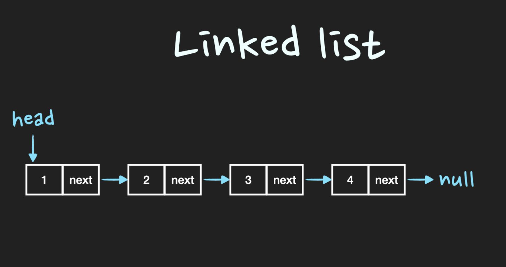

# 링크드리스트(LinkedList)

- [C++](./code/C++/LinkedList.cpp)
- Javascript
- Pyhton

## 링크드리스트

**`노드를 연결한 자료구조, 노드란 데이터를 갖고있는 데이터의 묶음과 참조값이 있는 구조체`**

> Linked List는 **물리적인 메모리상에서는 비연속적으로 저장**이 되지만 Linked list를 구성하는 각각의 Node가 next Node의 address를 가리킴으로써 **논리적인 연속성**을 가진 자료구조입니다.



## 링크드리스트의 특징

- 논리적으로 연속된 자료구조
- 물리적 메모리는 비 연속적으로 메모리 공간 차지
- 정확히 데이터의 수 만큼 메모리 공간을 차지한다.

## 링크드리스트 구현

클래스 구조

```cpp
struct Node{
  int data;
  Node* next;
};


class LinkedList{
  public:
    int size=0;
    Node* head;
    void InsertFirst(int data);//리스트에 첫번째 항목에 삽입
    void Delete(int n)//n번째 데이터 삭제
    int Search(int n)//n번째 데이터 조회
    void Print()//리스트 출력
}
```

### 삽입

InsertFirst 함수의 프로세스

1. 삽입할 노드를 만들고 인자로 들어온 데이터를 저장한다.
2. 헤드값을 가져온다. 헤드값이 없다면 새로만든 노드를 헤드로 지정한다.
3. 헤드값이 있다면 새로만든 노드의 next를 헤드값으로 해주고 해드값을 새로운 노드로 바꿔준다. 

### 삭제

1. 헤드값을 가져오고 헤드값이 없다면 비어있는 것이므로 return
2. 삭제할 순서가 리스트보다 크다면 잘못된 사용법이므로 return
3. while문을 통해 다음 노드로 검색해서 삭제할 순서가 될때까지 검색한다.
4. prev변수를 통해 검색 이전 노드를 저장하고 prev->next를 삭제할 노드의next로 연결한다.

### 조회

1. 헤드값을 가져오고 순서만큼 while문을 반복한다.

## 배열의 장점

- 포인터를 통하기 때문에 삽입, 삭제가 편하다
- 동적이므로 크기가 정해져 있지 않다.
- 메모리의 재사용 편리
- 불연속적이므로 메모리 관리의 편리

## 단점

- 검색 성능이 좋지 않다. (처음부터 다 조회해야됨)
- 포인터를 통해 다음 데이터를 가르키므로 추가적인 메모리 공간 발생.

## 배열 vs 링크드리스트

- 배열은 크기가 고정되어있지만 arrayList는 사이즈가 동적인 배열이다.
배열은 primitive type(int, byte, char 등)과 object 모두를 담을 수 있지만, arrayList는 object element만 담을 수 있다. - 기존 자료형이 정해져 있다는 뜻.
- 배열은 템플릿을 사용할 수 없지만, arrayList는 타입 안정성을 보장해주는 템플릿을 사용할 수 있다.
- 배열은 element들을 할당하기 위해 assignment(할당=) 연산자를 써야하고, arrayList는 add() 메서드를 통해 element를 삽입한다.
