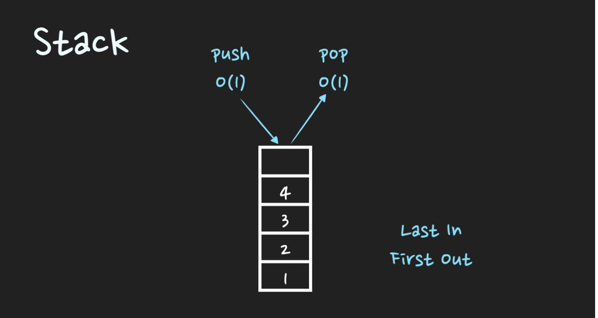
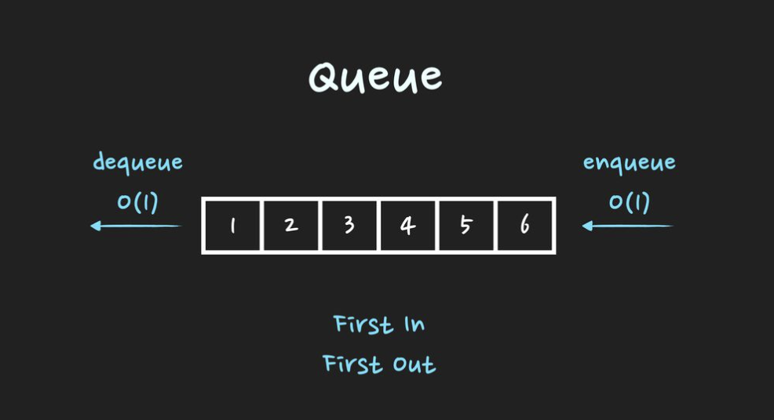

# 스택과 큐

Stack
- [C++](./code/C++/Stack.cpp)
- Javascript
- Python

-----
Queue
- [C++](./code/C++/Queue.cpp)
- Javascript
- Python
----

## 스택

- stack은 후입선출 LIFO(Last In First Out)의 자료구조입니다. 
- 시간복잡도는 push O(1) , pop O(1)  
- 활용 예시는 후위 표기법 연산, 괄호 유효성 검사, 웹 브라우저 방문기록(뒤로 가기), 깊이우선탐색(DFS).
- 활용예시:
함수의 콜스택, 문자열 역순 출력, 연산자 후위표기법, 웹 브라우저 뒤로 가기, 실행 취소 ....



## 스택구현 

배열을 이용해 구현하기

### 클래스 구조

```cpp
class St{
  public:
    int cur=-1;
    int arr[100];

    void push(int data); //데이터 넣음
    int pop(); //데이터 삭제
    bool isEmpty(); //스택 비어있나 확인
    bool isFull(); // 스택 가득찼나 확인
    int top(); //맨위에 있는 데이터 확인
}
```

### top

cur의 위치에 있는 인덱스에 접근해 반환

### Push

1. cur의 위치를 한칸+1해주고 arr에 해당하는 위치에 넣어준다.

### pop

1. cur의 위치에서 -1을 해준다.

### isEmpty 

1. cur의 위치가 -1인지 확인

### isFull

1. cur의 위치가 100-1인지 확인!

## 큐

- queue는 선입선출 FIFO(First In First Out)의 자료구조
- 시간복잡도는 enqueue O(1) , dequeue O(1)  
- 활용 예시는 Cache구현, 프로세스 관리, 너비우선탐색(BFS).
- 활용예시: 버퍼, 우선순위가 같은 작업 예약, 은행 업무, 콜센터 고객 대기, BFS



## 큐 구현

배열기반 구현

처음과 끝을 표기를 하고 그것을 이용해서 enqueue, dequeue를 해준다. 그리고 실제 인덱스로 처음과 끝을 표기하면 배열의 사용이 밀리는 현상이 발생하는데, 이를 개선한 것이 '원형 큐'

논리적으로 배열의 처음과 끝이 연결되어 있는 것으로 간주함!

### 클래스 구조

```cpp
#include <iostream>
using namespace std;
const int maxSize = 5;

class queue
{
	public:
		int front = 0, rear = 0;
		int cnt=0;
		int qu[maxSize] ={0,};

		void Enqueue(int t); //삽입
		int Dequeue(); //삭제
    bool isFull(); //가득찻나 확인
    bool isEmpty(); //비었나 확인
};
```

### Enqueue

rear에 해당하는 인덱스에 값 넣고 1 증가

### Dequeue

front에 위치한 값을 object에 꺼낸 후, 꺼낸 위치-1

### isFull

rear가 사이즈-1과 같아지면 가득찬 것

### isEmpty

front와 rear가 같아지면 비어진 것

## 스택과 큐의 특징

- 삽입, 삭제가 O(1)의 시간복잡도를 가짐!

## 참고자료 

- https://lktprogrammer.tistory.com/59